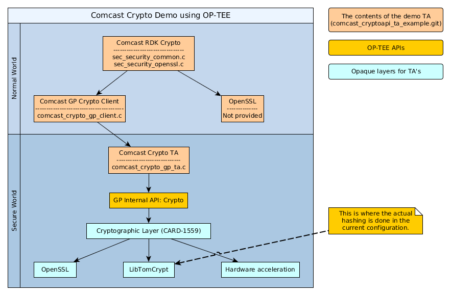

Demo TA using OP-TEE and Comcast Crypto API
---

This little demo Trusted Application serves the purpose of showing how you could open up functionality from a TEE or just simply how to interact with a TEE using GlobalPlatform interfaces. In this case we have been using OP-TEE as the TEE, but since OP-TEE is a GlobalPlatform compliant TEE. It should be possible to run the same application on other GlobalPlatform compliant TEEs also.

Comcast Crypto API
---
Comcast have released an open source Crypto API ([rdkcryptoapi](https://github.com/Comcast/rdkcryptoapi)) that are supposed to be used in the RDK software stack. This implementation makes use of OpenSSL running in normal world. Some functions in the API handles sensitive data and needs to be dealt with in secure world instead of normal world in a real product.

For this demo application we wanted to pick something not too complicated, so our choice fell on SHA1 and SHA256 hashing. In the rdkcryptoapi this done by calling the following functions.

```
Sec_Result SecDigest_GetInstance(Sec_ProcessorHandle* secProcHandle,
        Sec_DigestAlgorithm algorithm, Sec_DigestHandle** digestHandle) 
        
Sec_Result SecDigest_Update(Sec_DigestHandle* digestHandle,
        SEC_BYTE* input,SEC_SIZE inputSize)

Sec_Result SecDigest_Release(Sec_DigestHandle* digestHandle,
        SEC_BYTE* digestOutput, SEC_SIZE* digestSize, SEC_BYTE* input,
        SEC_SIZE inputSize)
```

They refer to the "init, update and final" functions when doing hash calculations.

GlobalPlatform Internal API : Crypto
---
When doing hashing using GlobalPlatforms Internal API, you only have two functions exposed, which are:

```
void TEE_DigestUpdate(TEE_OperationHandle operation,
                      void*chunk, uint32_t chunkSize)

TEE_Result TEE_DigestDoFinal(TEE_OperationHandle operation, const void *chunk,
                             size_t chunkLen, void *hash, size_t *hashLen)
```
As you can see they have omitted the init step with is done in the operations themselves. This makes it a bit problematic to map rdkcryptoapi to GlobalPlatform Crypto API. More on that later on.

Interaction and architecture
---
Conceptually the architecture and interaction between the components looks like in the image below. As you can see in the image, it tells where functionality is running, secure vs normal world and also in which component. To get a quick overview of where functionality has been implemented, we have also added the names of the files for the different software components. 



In this image the components marked with light red color are the software components involved in this demo (as source code, expect OpenSSL). The yellow component is the GlobalPlatform APIs in OP-TEE and finally the components in cyan are lower levels in OP-TEE that aren't exposed to Trusted Applications. But we still want to show that there is a possibility to switch between different cryptographic libraries in OP-TEE (as soon as CARD-1559 has been completed). This means that is some person prefer using OpenSSL in favor for LibTomCrypt one can make that choice in OP-TEE and if a company have hardware chip dedicated for cryptographic acceleration it is possible to use that instead of software libraries.

In this setup, we are using LibTomCrypt as our cryptographic library, so when you are calling the functions doing hash calculations in rdkcryptoapi you will finally end up in LibTomCrypts hash functions.

Building and running the TA
---
#### Building
Easiest way to test this is to run the script [setup_fvp_optee.sh](https://github.com/OP-TEE/optee_os/blob/master/scripts/setup_fvp_optee.sh) that could be found in the [optee_os](https://github.com/OP-TEE/optee_os) git at GitHub. This script will setup the complete environment needed to run OP-TEE on FVP (Foundation and Fast models) from ARM. When that has been done (takes ~1 hour to download and build all software, so please have patience), you will need to clone this git into the same root folder as you pointed out in the setup script.

In this git (comcast_cryptoapi_ta_example.git), there is the script [build_comcast_cryptoapi_ta_example](build_comcast_cryptoapi_ta_example) which we recommend that you use when build, since that sets the needed flags and points to the correct folders. You can of course call make directly on the commandline, but you will have to point out all the other things mentioned in "build_comcast_cryptoapi_ta_example" in any case. When this has been setup, you should be able to build the Trusted Application.

Next step is to get the newly built Trusted Application into the filesystem that is used when booting FVP. To do this you need to edit the file ```gen_rootfs/filelist-tee.txt``adding lines telling where to find and where to store the test binary and the Trusted Application, like this:

```
# TA's
....
file /lib/teetz/636f6d63-6173-7420-63727970746f2074.ta /home/johndoe/devel/fvp_optee/comcast_cryptoapi_ta_example/ta/out-client-aarch64/636f6d63-6173-7420-63727970746f2074.ta 444 0 0

# OP-TEE Tests
...
file /bin/comcast_crypto_demo /home/johndoe/devel/fvp_optee/comcast_cryptoapi_ta_example/host/comcast_crypto_demo 755 0 0 
```

When that has been done and the files has been saved, you need to regenerate the filesystem. That could be done by running the script ```update_rootfs.sh```. For you who wonder about the strange name of the Trusted Application, we can mention that this is coming from the UUID for the particular Trusted Application.

#### Running
1. Boot up Foundation Models by running ```run_foundation.sh``` and wait until you have a shell prompt.
2. Load the kernel module for OP-TEE and launch tee-supplicant, by typing:

   ```
   $ modprobe optee
   $ tee-supplicant &
   ```
3. Launch the test (and thereby the TA), by typing:

   ```
   $ comcast_crypto_demo
   ```

Problems / bugs
---
* Since rdkcryptoapi and GlobalPlatform Internal API doesn't have 1:1 mapping between the interfaces we had to stub/change/remove code in the digest functions in rdkcryptoapi. For the purpose of demonstrating how to call this functionality and how to open up functionality from secure world this works. But for a production device this needs to be handled in another way. You will probably need atleast two functions similar to how GlobalPlatform exposes this functionality, since there is a risk that you cannot fit all data to be hashed in memory.

* There is a bug in OP-TEE's digest functions, that prevents you from running zero length messages, which means that you either need to call both TEE_DigestUpdate() and TEE_DigestDoFinal() or only callig TEE_DigestDoFinal() (a fix for this is being implemented). This is the main reason why the changes done in rdkcryptoapi looks a bit strange.
